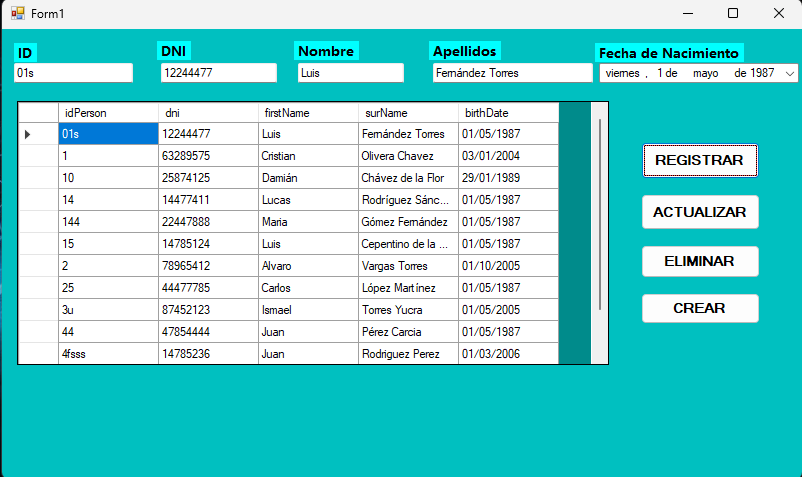
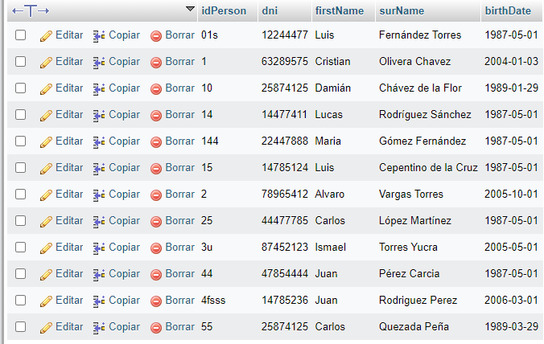

# CRUD + BD MySql + ADO.NET
## 📝 Descripción

Es una aplicación CRUD desarrollada en C#. Además, implementa el uso de expresiones regulares para la validez y el formato correcto de los datos ingresados.

### ✨ Funcionalidades Principales
- **Crear**: Crea nuevos registros al JTable con facilidad.
- **Registrar**: Agrega Registros de datos al `JTable`.
- **Actualizar**: Modifica registros existentes sin complicaciones.
- **Eliminar**: Borra registros no deseados de manera segura.
- **Validación**: Asegura que los datos ingresados cumplan con los formatos mediante expresiones regulares.
  
## Instalación y Configuración de MySQL con XAMPP

### Requisitos Previos
1. **XAMPP**: Asegúrate de tener XAMPP instalado en tu sistema. Puedes descargarlo desde [apachefriends.org](https://www.apachefriends.org/index.html).
1. **Conector MySql**: Asegúrate de tener el conector instalado en tu sistema. Puedes descargarlo desde [link](https://dev.mysql.com/downloads/connector/net/)

### Pasos para Configurar MySQL con XAMPP

1. **Iniciar XAMPP**:
   - Abre XAMPP y asegúrate de que los módulos Apache y MySQL estén iniciados.

2. **Acceder a phpMyAdmin**:
   - Abre tu navegador web y navega a `http://localhost/phpmyadmin`.

3. **Crear una Nueva Base de Datos**:
   - Haz clic en la pestaña `SQL` en phpMyAdmin.
   - Introduce el texto --> Base de datos.txt (se encuentra en el main) y presiona en `Continuar`.

4. **Ejecutar tu Aplicación**:
   - Ejecuta tu aplicación C# desde Visual Studio o mediante el archivo ejecutable generado.
## 🖼️ Captura de pantalla

